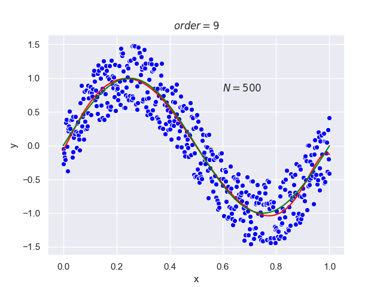
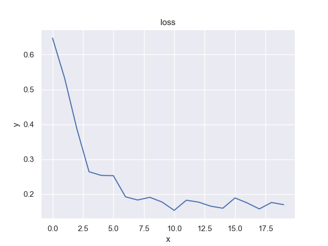

<center class="half">
    
</center>

# 现代人工智能技术HW1
Code Released for Homework1 of Modern AI course.
---

## HW1.1

### (1) 生成正弦序列s(n)

首先生成n序列，然后通过x序列生成$sin(n)$序列

```python
# s(n) = sin(n)
n = np.arange(0, 2 * np.pi, opt.point_interval)
s_n = np.sin(n)
```

###  (2) 使用噪声函数对正弦序列加噪 $x(n)=s(n)+w(n)$

这里定义噪声函数 $w(n)$为均匀分布的噪声，直接使用`numpy`随机数生成器生成；

```python
np.random.seed(123)
x_n = s_n + (np.random.rand(s_n.size) - 0.5)
```

在上面我们可以看到，我们为了保证每次随机噪声相同，手动设置了`numpy`随机数生成的seed

### (3) 使用多项式回归模型对$x(x)$进行拟合，并分析过拟合和欠拟合情况

多项式模型可以定义为如下形式：
$$
f(x)=\sum_{i=0}^{n}C_ix^i
$$
其中$n$为多项式模型的阶数。

一般使用最小二乘法对其进行拟合

我们的优化目标为：
$$
E(w)=\frac{1}{2}\sum_{n=1}^{N}\{y(x_n,w)-t_n\}
$$
为了避免过拟合，我们有时需要在优化目标中加入正则项，则优化目标变为：
$$
E(w)=\frac{1}{2}\sum_{n=1}^{N}\{y(x_n,w)-t_n\}+\frac{\lambda}{2}||w||^2
$$

#### 实现

首先定义目标函数：

```python
def cost(p, x, y, lam):
    ret = y - np.poly1d(p)(x)
    reg = np.sqrt(math.exp(lam)) * (p * p)
    ret = np.append(ret, reg)
    return ret
```

其中第一个参数 `p`为多项式模型中的参数，`x`和`y`为要拟合的数据，`lam`为代表正则项系数，其中另正则项系数为$\lambda$，则$ln(\lambda)=lam$。

根据目标函数对多项式模型进行最小二乘拟合，这里使用`scipy.optimize`中实现的最小二乘：

```python
from scipy.optimize import leastsq
p = np.zeros((order+1,1)) # 初始化参数
coff = leastsq(cost, p, args=(x, y, lam)) # 最小二乘
```

#### 结果分析

**生成的$sin(n)$序列：**


**加噪声后$x(n)​$序列：**


**使用9次曲线拟合$x(n)$:**


#### 分析过拟合和欠拟合的情况

过拟合主要会由**多项式阶数过高或者数据过少**造成，而欠拟合可能由于**多项式阶数过低、正则项系数过大**造成

---

##### 过拟合-阶数过高

|  |  |
| ------------------------------------ | ------------------------------------ |
|  |  |

如上图，说明了由多项式系数过高引起的过拟合，可以看到随着阶数的提高，**过拟合现象提升**，在最后一张九阶曲线

---

##### 过拟合-数据少

|   |  |
| ------------------------------------- | ------------------------------------- |
|  |  |

如上图，四张图所用多项式模型阶数相同，但是数据数量不同。第一张图点数只有15个点，明显曲线出现了过拟合的情况，剩下三张图通过增加数据量，有效**减小了过拟合**的现象。

---

##### 欠拟合-阶数低

|  |  |
| ------------------------------------ | ------------------------------------ |
|  |  |

如上图，数据点数相同，分别使用不同阶数的曲线拟合，明显可见**低阶多项式无法很好的拟合数据**，出现了欠拟合现象。

---

##### 正则的影响

|  |   |
| ---------------------------------------------- | --------------------------------------------- |
|   |  |

从上图可以看出，同样对于九次曲线，加入正则项后可以明显的减少过拟合的现象，但是当正则项过大的时候，欠拟合现象也会出现（如图四）

## HW1.2

### 1

Generate n = 2,000 points uniformly at random in the two-dimensional unit square. Which point do you expect the centroid to be?

```python
x = np.random.rand(opt.n)
y = np.random.rand(opt.n)
```

如上述代码所示，我们使用随机分布生成2000个点。他们的质心为如下：

```python
gt_centroid_x = np.average(x) # 0.5
gt_centroid_y = np.average(y) # 0.5
```

由于生成的x y坐标都是在0～1的均匀分布，所以他们的质心应该是在 $(0.5,0.5)$


### 2

What objective does the centroid of the points optimize?

根据Wikipediahttps://zh.wikipedia.org/wiki/%E5%87%A0%E4%BD%95%E4%B8%AD%E5%BF%83对于质心性质的说明：

> 这个中心是空间中一点到这有限个点距离的平方和的唯一[最小值](https://zh.wikipedia.org/wiki/%E6%9C%80%E5%B0%8F%E5%80%BC)点

#### 目标函数

所以我们可以将目标函数定义为：
$$
f(x,y)=\frac{1}{N}\sum_{i=1}^{N}(x-x_i)^2+(y-y_i)^2
$$


在代码中实现为：

```python
def loss(x, y, centroid_x, centroid_y):
    l2_distance_square = (x - centroid_x) ** 2 + (y - centroid_y) ** 2
    return sum(l2_distance_square) / len(x)
```

#### 求梯度

那么对目标函数求偏导即可
$$
\frac{\partial{f(x,y)}}{\partial{x}}=\frac{1}{N}\sum_{i=1}^{N}2x-2x_i
$$

$$
\frac{\partial{f(x,y)}}{\partial{y}}=\frac{1}{N}\sum_{i=1}^{N}2y-2y_i
$$


在代码中实现为：

```python
# gradient function
def gradient(x, y, centroid_x, centroid_y):
    d_x = 2 * (centroid_x - x)
    d_y = 2 * (centroid_y - y)
    return sum(d_x) / len(x), sum(d_y) / len(y)
```

上述两个步骤，**定义目标函数和求梯度**就是梯度下降法的两个最重要的部分，接下来我们只需要在每次迭代中计算梯度，并根据梯度更新当前质心的位置即可。

### 3

Apply gradient descent (GD) to find the centroid.

使用梯度下降寻找质心有以下步骤：

1. 初始化质心

   ```python
   # init value for centroid
   centroid_x, centroid_y = 1.0, 1.0
   ```

2. 计算梯度

   ```python
   loss_value = loss(sample_x, sample_y, centroid_x, centroid_y)
   g_x, g_y = gradient(sample_x, sample_y, centroid_x, centroid_y)
   ```

3. 更新质心

   ```python
   centroid_x, centroid_y = centroid_x - opt.lr * g_x, centroid_y - opt.lr * g_y
   ```

4. 重复2和3直至loss收敛

在上述步骤中，主要是有两个参数需要指定，一个为学习率(learning rate)，一个为迭代数。接下来分别调整以上两个参数做对照实验：


**lr=0.1 iter=20**


**lr=0.01 iter=200**


### 4

Apply stochastic gradient descent (SGD) to find the centroid. Can you say in simple words, what the algorithm is doing?

随机梯度下降与梯度下降的区别在于，随机梯度下降每次使用**部分**数据参与计算梯度，而梯度下降使用**全部**数据参与计算梯度。随机梯度下降的优点包括减少过拟合，提升训练速度。

所以相比梯度下降，随机梯度下降步骤如下：（**唯一的区别就在于2**）

1. 初始化质心

   ```python
   # init value for centroid
   centroid_x, centroid_y = 1.0, 1.0
   ```

2. 从点中抽样数据

   ```python
   start_index = (iter_index * opt.bs) % opt.n
   sample_x, sample_y = x[start_index:start_index + opt.bs], y[start_index:start_index + opt.bs]
   ```

   

3. 使用抽样数据计算梯度

   ```python
   loss_value = loss(sample_x, sample_y, centroid_x, centroid_y)
   g_x, g_y = gradient(sample_x, sample_y, centroid_x, centroid_y)
   ```

4. 更新质心

   ```python
   centroid_x, centroid_y = centroid_x - opt.lr * g_x, centroid_y - opt.lr * g_y
   ```

5. 重复2、3、4直至loss收敛

对于随机梯度下降，所需要的参数与梯度下降类似，但是多出一个batch size的参数，**意为每次用于计算梯度的点的个数**。接下来分别调整以上三个参数做对照实验：

**lr=0.1 iter=20 bs=50**


**lr=0.1 iter=20 bs=200**




### 更多实验数据

|      |      |
| ------------------------------------------------------ | --------------------------------------------------- |
|      |      |
|      |      |
|      |      |
|  |  |

